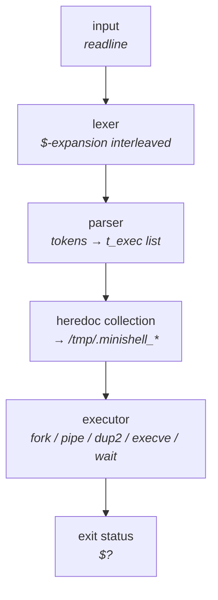
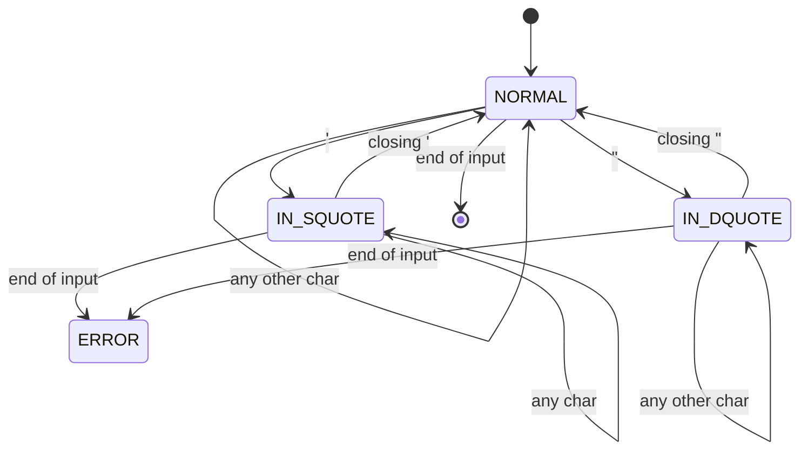
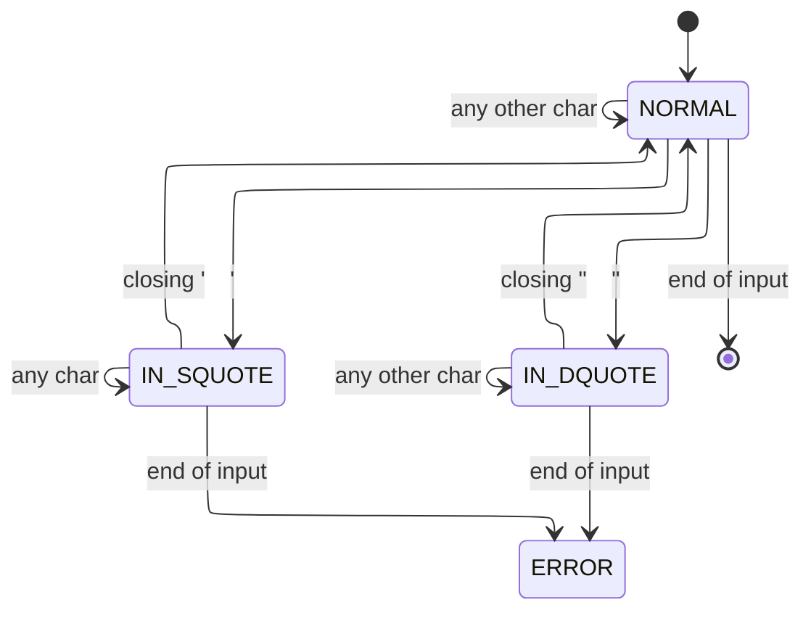
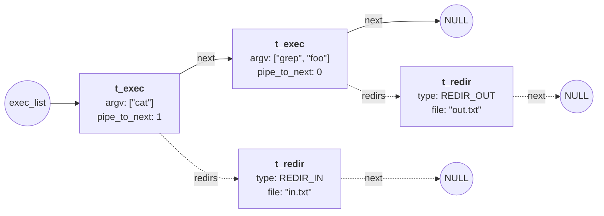
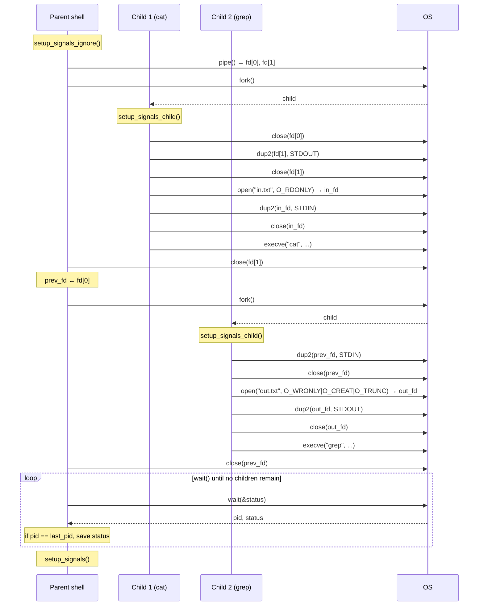
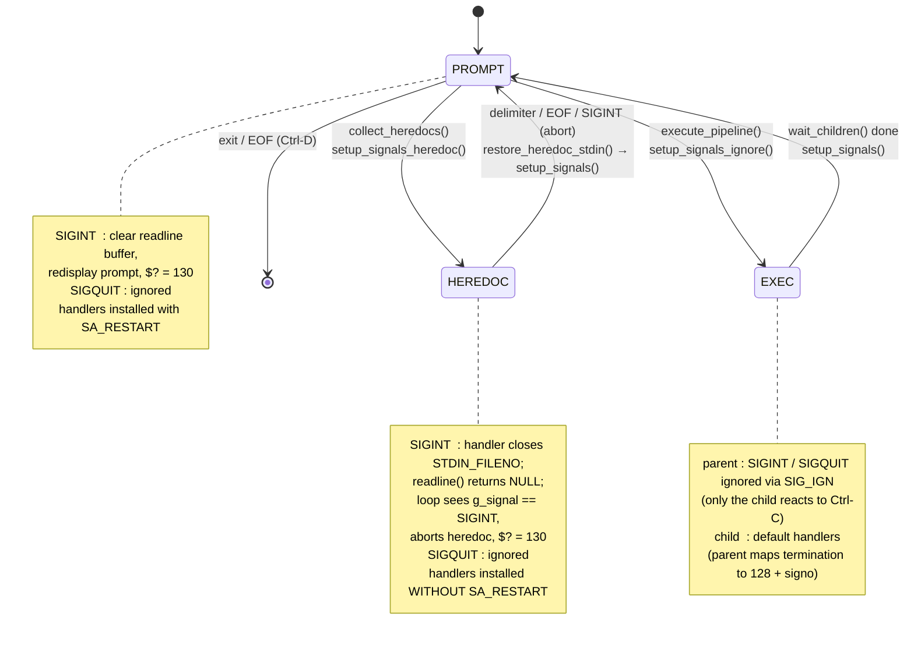

*This project has been created as part of the 42 curriculum by sjoung, jkim2*

# minishell

## Table of Contents

- [Description](#description)
- [Instructions](#instructions)
- [Resources](#resources)
- [Source Map](#source-map)
- [1. Architecture at a Glance](#1-architecture-at-a-glance)
- [2. Input Processing](#2-input-processing)
- [3. Internal Command Representation](#3-internal-command-representation)
- [4. Execution Model](#4-execution-model)
- [5. Signal Handling](#5-signal-handling)
- [6. Edge Cases / Testing](#6-edge-cases--testing)
- [7. Subject Requirement Map](#7-subject-requirement-map)

## Description

`minishell` is a minimal interactive shell implemented in C, recreating a subset of `bash`'s behavior. The goal is to gain a hands-on understanding of how a shell parses user input, manages processes, and wires them together with pipes, redirections, and signals — while remaining compatible with `bash` semantics wherever the subject calls for it.

This implementation covers the **mandatory** scope only. List operators (`&&`, `||`, `;`), subshell grouping `( ... )`, and globbing are out of scope.

**Supported features:**

- Interactive prompt via GNU Readline (line editing, history)
- Pipelines of arbitrary length: `cmd1 | cmd2 | ... | cmdN`
- I/O redirections: `<`, `>`, `>>`, and `<<` (heredoc)
- Variable expansion: `$VAR`, `$?`
- Single- and double-quote handling for the mandatory subject subset: single quotes suppress all expansion; double quotes preserve literal text except `$` expansion
- Seven built-in commands: `echo` (with `-n`), `cd` (with logical `PWD` / `OLDPWD`), `pwd`, `export`, `unset`, `env`, `exit`
- Signal handling in three modes (prompt, heredoc input, child execution), matching `bash` for `Ctrl-C`, `Ctrl-\`, and `Ctrl-D`
- Exit status propagation including signal-terminated children (`$? = 128 + signo`) and `bash`'s pipeline-last-command semantics

## Instructions

Build:

```sh
make
```

Run:

```sh
./minishell
```

Clean:

```sh
make clean    # remove object files
make fclean   # remove objects + binary
make re       # full rebuild
```

The build links against GNU Readline (`-lreadline`). On macOS development, add `-I/opt/homebrew/opt/readline/include` to `CFLAGS` and `-L/opt/homebrew/opt/readline/lib` to `LDFLAGS` as needed for your local setup.

## Resources

Classic references:

- **Bash manual** — https://www.gnu.org/software/bash/manual/
- **GNU Readline manual** — https://tiswww.case.edu/php/chet/readline/readline.html
- **POSIX Shell Command Language**, Open Group Base Specifications, Issue 7 — https://pubs.opengroup.org/onlinepubs/9699919799/utilities/V3_chap02.html
- **W. R. Stevens & S. A. Rago**, *Advanced Programming in the UNIX Environment* — chapters on process control, signals, and terminal I/O

### AI usage

Claude (Anthropic) was used during development for the following tasks:

- **Diagram drafting and review.** The overview flowchart, lexer FSM, parsed-command-representation diagram, pipeline sequence diagram, and signal-handling state diagram below were drafted iteratively with Claude and corrected against the actual implementation across multiple rounds.
- **Documentation prose.** The text surrounding each diagram in this README was edited together with Claude for accuracy against the codebase.

Implementation, debugging, and final design decisions were carried out by the authors.

---

## Source Map

Quick orientation by area, useful before diving into the architectural sections below:

| Area | Files |
|---|---|
| Entry / main loop | `main.c`, `run_loop.c` |
| Lexer & `$`-expansion | `lexer.c`, `read_word.c`, `expand_variable.c`, `add_token.c`, `token_lst.c`, `char_utils.c` |
| Parser & command list | `parse.c`, `argv_unit.c`, `redir_lst.c`, `exec_lst.c` |
| Heredoc | `heredoc.c`, `heredoc_io.c`, `heredoc_cleanup.c` |
| Execution & wait | `execute_pipeline.c`, `execute_wait.c`, `apply_redirections.c`, `exec_path.c` |
| Builtins | `builtins.c`, `builtin_basic.c`, `builtin_cd.c`, `builtin_exit.c`, `builtin_export_unset.c` |
| Environment | `env_unit.c`, `builtin_env_ops.c`, `builtin_env_set.c` |
| Signals & terminal | `signals.c`, `signals_heredoc.c`, `terminal.c` |
| Logical path handling | `path_logical.c` |
| Misc helpers | `unit.c` |

## 1. Architecture at a Glance

A line typed at the prompt passes through five phases before producing an exit status:



Two things in this diagram are worth flagging up front:

- **There is no separate expander phase.** `$VAR` and `$?` expansion happens inside `read_word()` while the lexer is still consuming the input, not afterwards. The expansion rules are simple enough — driven entirely by quote context — that interleaving them keeps the relevant code in one place.
- **Heredoc collection is its own phase.** After parsing, every `<<` redirection has its body collected to a temporary file under `/tmp/.minishell_new_heredoc_*` *before* the executor runs. The signal handler is briefly swapped to a heredoc-specific one during this phase (see §5).

## 2. Input Processing

### 2.1 Lexer (with `$`-expansion)

The lexer (`lexer.c`, `read_word.c`) consumes the input one character at a time, producing a linked list of typed tokens (`TOKEN_WORD`, `TOKEN_PIPE`, `TOKEN_REDIR_IN`, `TOKEN_HERE_DOC`, etc.). Operator tokens are recognised at the top level of `lexer_state()`; everything else enters `read_word()`, which is itself a small loop joining pieces from three sub-readers — `read_plain`, `read_single_quote`, `read_double_quote` — together with inline `$`-expansion.

The interleaving is direct: inside `read_word()`'s piece dispatcher, a `$` jumps straight to the expander without first producing a separate `$` token:

```c
if (**line == '$')
    return (expand_variable(line, sh));
```

The most subtle part of the lexer is quote handling, so it is modeled separately as a finite state machine:


The diagram below presents the same information as the one above, but in a more organized format. Since it may not display properly in certain environments (e.g., GitHub), we are including both versions.

This FSM models **only the quote dimension** of tokenization:

- `$` triggers variable expansion in both `NORMAL` and `IN_DQUOTE` (as a side effect on the self-loop) but does not change state.
- `$` inside `IN_SQUOTE` is literal — no expansion, no escape sequences.
- Operator tokenization (`|`, `<`, `<<`, `>`, `>>`) and word-boundary detection (whitespace terminates a word in `NORMAL`) happen at the `lexer_state()` level above this FSM and are not modeled here.

### 2.2 Parser

The parser (`parse.c`) consumes the token list and produces the structure detailed in §3. Syntax errors — leading/trailing pipes, missing redirection targets, two consecutive pipes — are detected here, not in the lexer.

## 3. Internal Command Representation

For the input `cat < in.txt | grep foo > out.txt`, the parser produces:



```c
typedef struct s_exec
{
    char            **argv;
    t_redir         *redirs;
    int             pipe_to_next;
    struct s_exec   *next;
}   t_exec;
```

The parser deliberately flattens the command list into a singly-linked list rather than building an AST. Since the subject scope is limited to pipes (`|`) without `&&`, `||`, `;`, or subshells, no operator precedence needs to be encoded, and a flat list suffices. Each `t_exec` node carries a `pipe_to_next` flag indicating whether its stdout should be piped into the next node. Redirections attached to a command are kept in their own sub-list (`t_redir`), preserving lexical order so that `bash`'s "last-redirect-wins" semantics can be honored at application time.

## 4. Execution Model

For the same example `cat < in.txt | grep foo > out.txt`, the runtime sequence is:



A few details worth calling out:

- **The parent closes its pipe write-end immediately after forking the writer.** If the parent kept `fd[1]` open while forking the reader, the reader (`grep`) would never observe EOF on its stdin and would hang. This is the most common pipeline bug, and the close ordering in `spawn_pipeline()` exists precisely to avoid it.
- **In the child, pipe-dup happens before file-redirection.** When both apply to the same standard fd (in longer pipelines), file redirection is meant to override the pipe binding — `bash`'s "last redirect wins". Reversing the order would silently lose redirections.
- **The parent uses `wait()` in an unbounded loop, not `waitpid()` per child.** `wait_children()` reaps every child and keeps only the exit status of the last command in the pipeline. This matches `bash`: in `false | true`, `$?` is `0`.

### Builtin parent/child policy

| Situation | Where executed | Rationale |
|---|---|---|
| Standalone builtin (no pipe) | Parent, no fork | Side effects of `cd`, `export`, `unset` must persist in the shell process |
| Builtin within a pipeline | Forked child | Pipeline semantics require independent processes |
| External command | Forked child | `execve` replaces the process image |

## 5. Signal Handling

The shell runs in one of three signal contexts and switches handlers as it moves between them:



A single command line may traverse this graph multiple times. For example, `cat << EOF | wc -l` goes `PROMPT → HEREDOC → PROMPT → EXEC → PROMPT`; the brief return to `PROMPT` between heredoc and execution is when `setup_signals()` reinstalls the prompt handlers before the pipeline-time handlers take over.

### Per-mode behavior

| Mode | SIGINT | SIGQUIT | EOF (Ctrl-D) |
|---|---|---|---|
| PROMPT | clear readline buffer, redisplay prompt, `$? = 130` | ignored | exit shell |
| HEREDOC | handler closes `STDIN_FILENO`; `readline()` returns `NULL`; collector calls `abort_heredoc()`, `$? = 130` | ignored | end heredoc normally (treated as delimiter) |
| EXEC (parent) | ignored via SIG_IGN — only the child reacts | ignored | n/a |
| EXEC (child) | default — parent reports `$? = 128 + signo` | default (`131`) | n/a |

### Implementation notes

- **`g_signal` global.** The handlers never access shell-owned AST/token/env structures. The heredoc handler is intentionally minimal — only `write(2)`, `g_signal = sig`, and `close(STDIN_FILENO)` to break `readline()`. The prompt `SIGINT` handler additionally calls Readline's redisplay helpers (`rl_on_new_line`, `rl_replace_line`, `rl_redisplay`) so the prompt is redrawn cleanly after the interrupt; the main loop checks `g_signal` at the next safe point. This single global is the subject-allowed exception to `norminette`'s no-global-variable rule.
- **`SA_RESTART` is mode-specific.** Prompt handlers use `SA_RESTART` so `readline()` is not interrupted by other signals. Heredoc handlers omit `SA_RESTART` and additionally `close(STDIN_FILENO)` from inside the handler, which makes the heredoc's `readline()` return immediately so the loop can observe `g_signal` and clean up.

## 6. Edge Cases / Testing

- **Quotes.** `'$HOME'` stays literal; `"$HOME"` expands; adjacent quoted segments concatenate into a single word (`'a''b'` → `ab`; `"$HOME"/bin` → e.g. `/Users/jihoon/bin`).
- **Empty expansion.** `$UNDEF` in an unquoted context produces no word at all — `echo $UNDEF after` prints `after`. In a quoted context it produces an empty string.
- **Missing redirection target after expansion.** When an unquoted expansion like `$UNDEF` produces no word after a redirection operator (e.g. `> $UNDEF`), `read_word()` flags it as `ambiguous redirect` and sets `$? = 1` (this implementation does **not** convert this case into a parser syntax error).
- **Heredoc interrupt.** Pressing `Ctrl-C` during heredoc input aborts the current command, unlinks the temporary file, and returns to the prompt with `$? = 130`. Verified with a PTY-based test (methodology in *Heredoc-interrupt verification* below).
- **Exit status.** Pipeline status follows the last command; signal-terminated children produce `128 + signo`; `exit abc` exits with `2` (non-numeric argument), matching modern `bash`.

### Test summary

| Suite | Result |
|---|---|
| `LucasKuhn/minishell_tester` (community) | **146 / 146 pass** |
| `norminette` | OK except for the subject-allowed single signal global `g_signal` |
| Memory check — `leaks` on macOS (jkim2), cross-checked against `valgrind` on Linux | **0 leaks** on every required scenario, no discrepancy between the two tools |

### Pipeline exit-status conformance

The pipeline's last-command semantics were probed against `bash` across a range of last-stage failures, including non-numeric `exit` arguments:

| Pipeline | `$?` | Reason |
|---|---|---|
| `echo hi \| exit 42` | 42 | last command's literal exit |
| `echo hi \| exit 2` | 2 | last command's literal exit |
| `echo hi \| exit 255` | 255 | last command's literal exit |
| `echo hi \| echo ok` | 0 | last command succeeded |
| `echo hi \| cd /no_such_dir` | 1 | last command (`cd`) failed |
| `echo hi \| exit abc` | 2 | non-numeric arg; `builtin_exit` returns 2, child falls through to `exit(2)` |

### Heredoc-interrupt verification

Because `Ctrl-C` during heredoc input is hard to trigger from a plain pipe (`readline` needs a controlling terminal to behave as it does interactively), it was verified with a PTY-based test that uses Python's `pty.fork()` to:

1. Start `./minishell` as a child under a PTY.
2. Send `cat << EOF\n` and wait for the heredoc continuation prompt `> `.
3. Send `\x03` (Ctrl-C).
4. Wait for the main prompt to return and probe `$?` via `echo STATUS:$?`.

Expected outcome: `STATUS:130`, exactly one `> ` prompt before the interrupt, and no leftover `/tmp/.minishell_new_heredoc_*` files. (The repository currently documents this PTY procedure but does not include an automated test script for it.)

### Known warnings

- **`norminette`** prints the expected global-variable notice for the single subject-allowed signal global, `g_signal`, in `minishell.h` and `main.c`. All other source and header files report `OK`.
- **Memory tools.** Primary leak detection used `leaks --atExit` on macOS (jkim2); the same scenarios were cross-checked against `valgrind --leak-check=full` on Linux. Both tools report `0 leaks` on every required scenario, with no behavioral discrepancy observed between them. (On macOS, `leaks` additionally prints `Process is not debuggable` when invoked from the curated test environment — this is a tool-side notice and does not affect the leak count.)

### Reproducing the validation

```sh
make fclean && make                            # clean build
norminette                                     # norm check
```

The community tester (`LucasKuhn/minishell_tester`) was used during development and is not included in this repository. To reproduce the `146 / 146` result, clone it separately outside the project directory and run `./tester` from there.

Representative leak checks on macOS (each must report `0 leaks for 0 total leaked bytes`):

```sh
printf 'echo hi\nexit\n'                      | leaks --atExit -- ./minishell
printf 'export FOO=bar\necho $FOO\nexit\n'    | leaks --atExit -- ./minishell
printf 'echo hi | cat\nexit\n'                | leaks --atExit -- ./minishell
printf 'cat << EOF\nleakcheck\nEOF\nexit\n'   | leaks --atExit -- ./minishell
```

On Linux, substitute `valgrind --leak-check=full --error-exitcode=1 ./minishell < input.txt` for the same scenarios.

## 7. Subject Requirement Map

For evaluators navigating the 42 subject against this implementation, and as a quick-recall index for defense:

| Subject requirement | Implementation | Quick test |
|---|---|---|
| Interactive prompt + history | `run_loop.c` (`readline()`, `add_history()`) | `./minishell`, type a command, press ↑ |
| `PATH` lookup, absolute, relative | `exec_path.c::resolve_path`, `search_path` | `ls`, `/bin/ls`, `./script` |
| One signal global | `g_signal` in `main.c`, `extern` in `minishell.h` | `grep -n g_signal main.c minishell.h` |
| Single quotes (suppress expansion) | `read_word.c::read_single_quote` | `echo '$HOME'` → literal `$HOME` |
| Double quotes (`$` expansion only) | `read_word.c::read_double_quote` | `echo "$HOME"` → expanded |
| `<` input redirection | `apply_redirections.c::open_redir_file` (`O_RDONLY`) | `cat < /etc/hostname` |
| `>` output redirection | same (`O_WRONLY \| O_CREAT \| O_TRUNC`) | `echo hi > /tmp/x; cat /tmp/x` |
| `>>` append | same (`O_WRONLY \| O_CREAT \| O_APPEND`) | `echo a > /tmp/x; echo b >> /tmp/x; cat /tmp/x` |
| `<<` heredoc | `heredoc.c::collect_heredocs`, `heredoc_io.c` | `cat << EOF` ... `EOF` |
| Pipes `\|` | `execute_pipeline.c::execute_pipeline`, `spawn_pipeline` | `echo a b c \| wc -w` → `3` |
| `$VAR` / `$?` expansion | `expand_variable.c::expand_variable` | `echo $HOME`; `false; echo $?` → `1` |
| Ctrl-C at prompt | `signals.c::sigint_handler` + `setup_signals` | press Ctrl-C → new prompt, `$? = 130` |
| Ctrl-D (EOF) at prompt | `run_loop.c` (`!line` branch in `run_loop()`) | press Ctrl-D at empty prompt → shell exits |
| Ctrl-\\ | `signals.c::setup_signals` (`SIGQUIT` → `SIG_IGN`) | press Ctrl-\\ at prompt → nothing happens |
| `echo` with `-n` | `builtin_basic.c::builtin_echo` (accepts `-n`, `-nn`, ...) | `echo -n hi; echo done` → `hidone` |
| `cd` (relative/absolute) | `builtin_cd.c` + `path_logical.c` (logical `PWD` / `OLDPWD`) | `cd /tmp; pwd` |
| `pwd` | `builtin_basic.c::builtin_pwd` | `pwd` |
| `export` (no options) | `builtin_export_unset.c::builtin_export` | `export FOO=bar; env \| grep FOO` |
| `unset` (no options) | `builtin_export_unset.c::builtin_unset` | `export FOO=bar; unset FOO; echo "$FOO-"` → `-` |
| `env` (no options) | `builtin_basic.c::builtin_env` | `env \| head` |
| `exit` (no options) | `builtin_exit.c::builtin_exit` | `exit 42` → shell exits, parent `$? = 42` |
| Pipeline `$?` semantics (last command) | `execute_wait.c::wait_children` (saves last pid's status) | `false \| true; echo $?` → `0` |
| Signal-terminated `$?` (`128 + signo`) | `execute_wait.c::wait_to_status` | run `cat`, press Ctrl-C, then `echo $?` → `130` |
